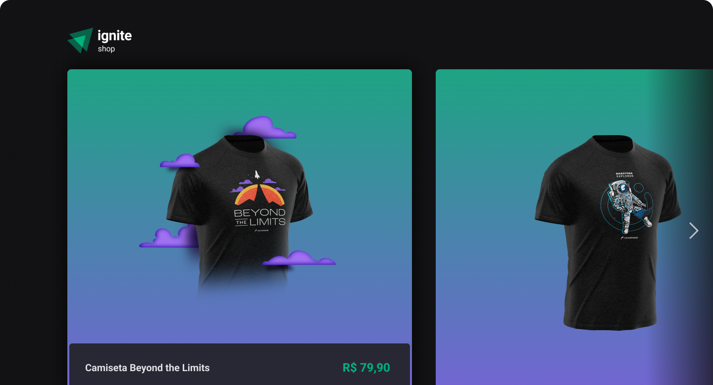

<h1 align="center"></h1>

<h3 align="center">Shop</h3>

<p align="center">“Software developers are students forever 🧠”</p>

<p align="center">
  <a href="#about">Sobre</a>&nbsp;&nbsp;&nbsp;|&nbsp;&nbsp;&nbsp;
  <a href="#install">Instalação</a>&nbsp;&nbsp;&nbsp;|&nbsp;&nbsp;&nbsp;
  <a href="#challenge">Desafios</a>&nbsp;&nbsp;&nbsp;|&nbsp;&nbsp;&nbsp;
  <a href="#technologies">Tecnologias</a>
</p>

## :speech_balloon: Sobre <a name="about"></a>

> [Shop](https://shop-douglasscaini.vercel.app/) é um e-commerce onde você pode comprar algumas camisetas daora.
>
> A compra não é efetivada, pois, essa aplicação foi realizada para portfólio e desenvolvida para fins estudantis.

<br />
<table>
  <tr>
    <td colspan="1">Web App</td>
  </tr>
  <tr>
    <td></td></td>
  </tr>
</table>

## :warning: Instalação <a name="install"></a>

```bash
# Instalar as dependências necessárias:
$ npm install

# Configurar variáveis de ambiente:
$ .env.example → .env.local

# Iniciar o projeto:
$ npm run dev

# Ambiente de produção:
$ É possível testar a compra com o cartão número: '4242 4242 4242 4242'
```

## :triangular_flag_on_post: Desafio <a name="challenge"></a>

> Utilizamos Next para construir a aplicação. Isso envolveu conceitos como SSR e SSG.
>
> Também integramos com o Stripe. Dessa forma podemos efetuar a compra de um produto rapidamente.

## :heavy_check_mark: Tecnologias <a name="technologies"></a>

-   [Next](https://nextjs.org/)
-   [Stripe](https://stripe.com/br)
-   [Stitches](https://stitches.dev/)
-   [TypeScript](https://www.typescriptlang.org/)

---

by [Douglas Scaini](https://www.github.com/douglasscaini) ❤️
